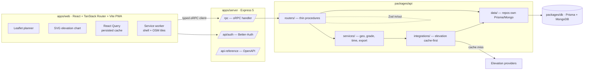

# Architecture Overview (T9.1)

> High-level component + request flow. Monorepo: `apps/web`, `apps/server`, `packages/*`.

## Layering rules (enforced)
- **Procedures** are thin: Zod-validate → call a service → return typed output. No math, no direct DB.
- **Services** are pure and unit-tested: geo math, smoothing, Naismith/Tobler, Shenandoah grading, export.
- **Data layer** owns *all* Prisma / raw-Mongo (`$geoNear` via `aggregateRaw`).
- **Integrations** wrap external elevation providers behind a cache-first service.
- Types flow end-to-end: the web client infers its types from the server's `AppRouter` — no duplication.
