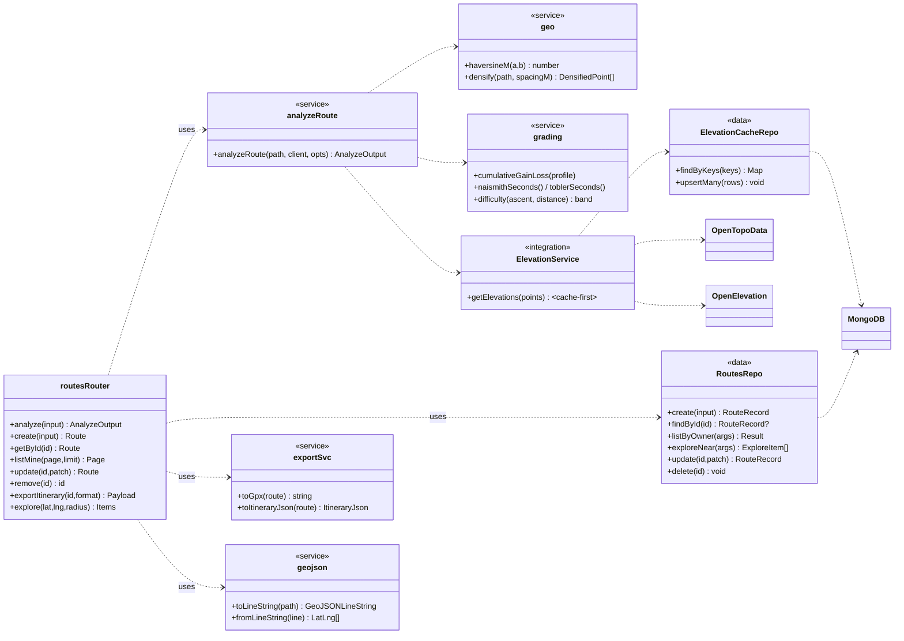

# Class Diagram / Low-Level Design (T9.3)

> The layered backend (PROJECT-SPEC §3): procedures (thin) → services (pure) → data (owns Prisma/Mongo)
> → integrations (elevation). Rendered as Mermaid.

