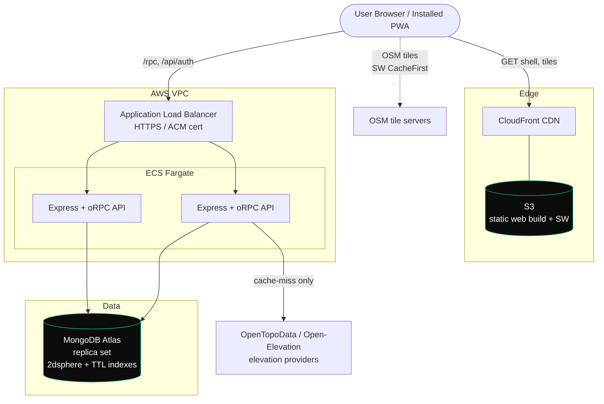
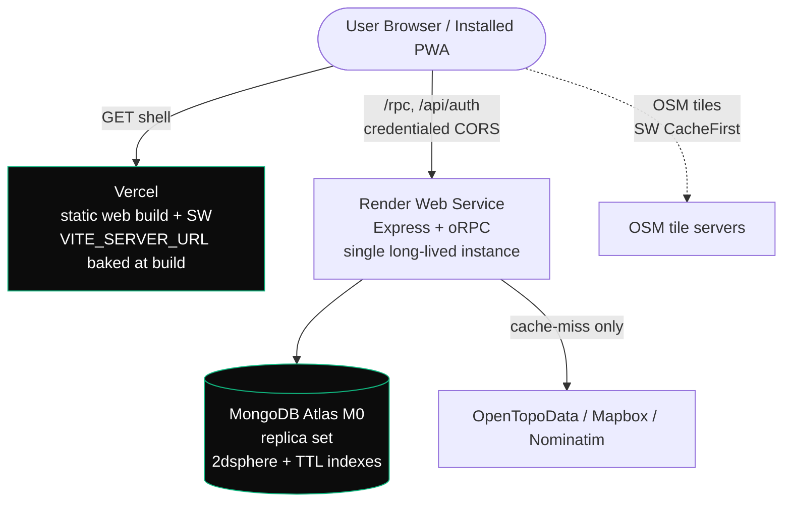

# Deployment Diagram — AWS target (T9.5)

> **This is the scale-up reference topology, not what is deployed.** The live deployment is Render +
> Vercel + MongoDB Atlas — diagrammed at the bottom of this file, with the rationale in
> [`../decisions/hosting.md`](../decisions/hosting.md). Local dev uses Docker Compose (single-node
> Mongo replica set) + Vite + the Express server.
>
> The AWS shape below is retained because the capstone template asks for a documented deployment flow
> and because it is where this design goes if it ever needs horizontal scale — note that the two API
> tasks shown assume the in-memory rate limiters have been moved to shared storage first.

## Notes
- **Static web** (React build + service worker) → S3 behind CloudFront; the PWA shell + OSM tiles are
  cached client-side (M8), cutting edge load.
- **API** (stateless Express/oRPC) scales horizontally on ECS Fargate behind an ALB; sessions are cookie
  + DB backed (Better-Auth), so any task can serve any request.
- **MongoDB Atlas** replica set (dev mirrors this with a single-node `rs0`) — required for the geo indexes
  and transactions; `db push` manages the schema, `setup-indexes.ts` the geo/TTL indexes.
- **Elevation providers** are hit **only on cache miss**; the `ElevationCache` collection (TTL 30d)
  absorbs repeat traffic — the headline optimisation (see benchmarks).
- **"Stateless" is aspirational, not current.** The HTTP and auth rate limiters keep counters in
  process memory, and the elevation quota guard is a process-global limiter + daily breaker. The two
  API tasks drawn above would each enforce their own limits, so this topology needs those moved to
  shared storage before it is correct. That is precisely why the live deployment runs a single
  long-lived instance.

---

## As deployed

One instance, one web origin. `CORS_ORIGIN` names the Vercel domain exactly, and `BETTER_AUTH_URL`
is the `https://` Render URL — the scheme is what makes the session cookie `Secure`/`SameSite=None`.
Full procedure in [`../RUNBOOK.md`](../RUNBOOK.md).
