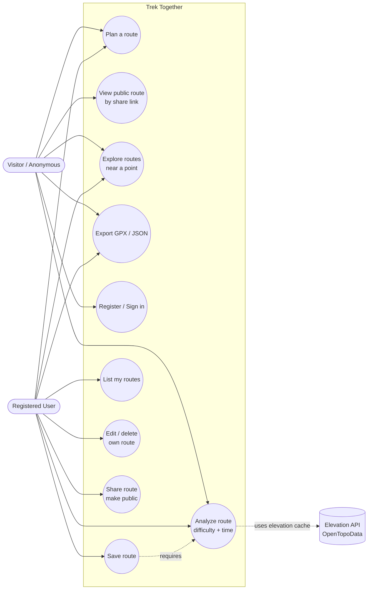
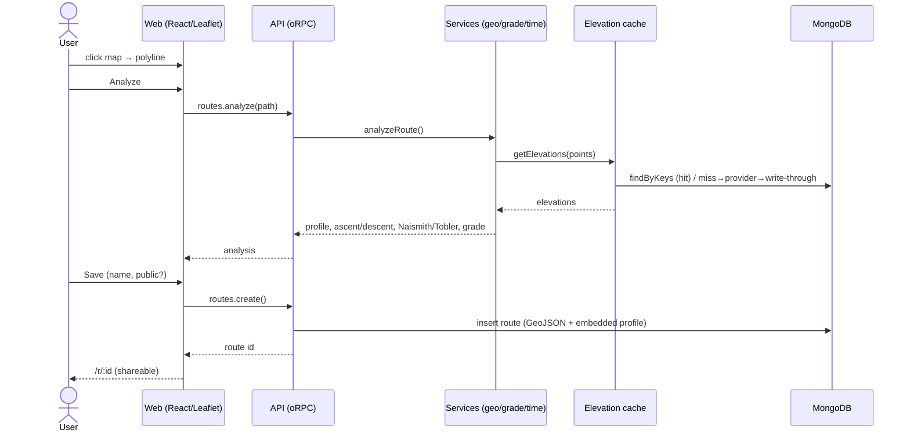

# Use-Case Diagram (T9.2)

> Rendered as Mermaid (GitHub-native, version-controlled) in place of drawio/PNG.
> Actors and use cases follow PRD §5.

## Primary flow — plan → analyze → save → share

